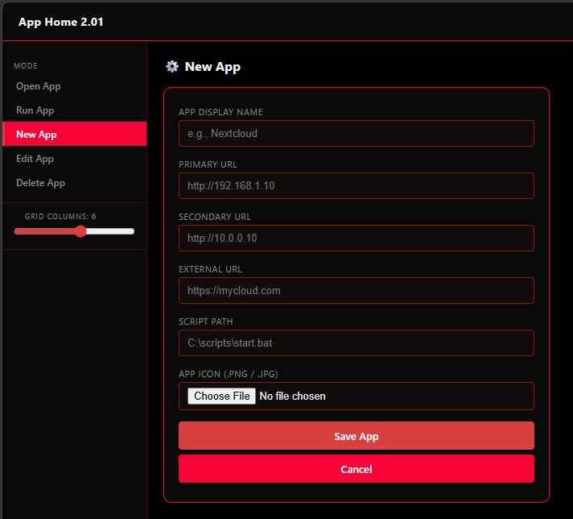
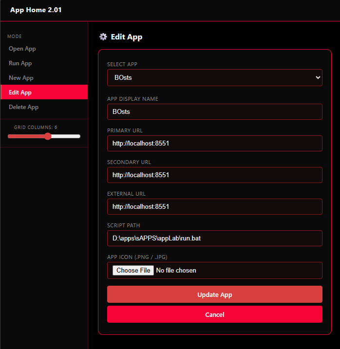
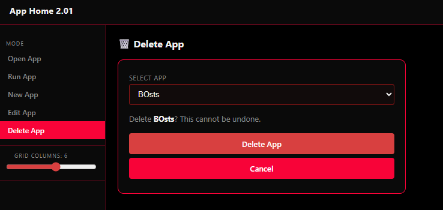
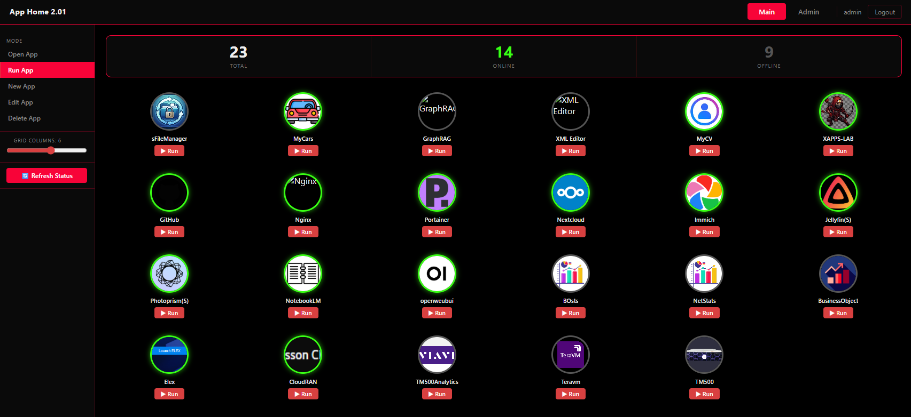

# App Home 2.01

A self-hosted home server dashboard for launching and monitoring personal apps from one place. Built with **React + Vite** on the frontend and **Node.js + Express** on the backend.

---

## Features

- **App launcher** — icon grid with live online/offline status (lime green ring = reachable)
- **Drag to reorder** — drag icons to rearrange the grid; order persists in the browser
- **Run scripts** — launch a local `.bat` / `.sh` script for any app from the browser
- **Admin panel** — manage users (activate / delete) and import or export `apps.yaml`
- **JWT authentication** — login with username + password; new accounts require admin approval
- **Default admin** — ships with `admin` / `passw0rd`; password change is enforced on first login
- **Docker-ready** — single `docker compose up --build` on Linux or Windows

---

## Preview

### Dashboard


<video src="screenshot/openapps.mp4" controls width="100%">
  <a href="screenshot/openapps.mp4">▶ Watch demo video</a>
</video>

### Managing Apps

| Add | Edit | Delete |
|-----|------|--------|
|  |  |  |

### Running an App



---

## Project Structure

```
appHome/
├── frontend/                   React + Vite SPA
│   └── src/
│       ├── App.jsx             Root — auth gate, tab layout, global state
│       ├── api.js              Typed fetch wrapper for all API calls
│       ├── theme.js            Colour tokens (dark red palette, lime green online)
│       └── components/
│           ├── LoginPanel.jsx
│           ├── ChangePassword.jsx
│           ├── Sidebar.jsx         Mode nav + grid-column slider
│           ├── AppGrid.jsx         Draggable icon grid
│           ├── MetricsBar.jsx      Total / Online / Offline counters
│           ├── AppForm.jsx         Create / Edit / Delete form
│           └── AdminTab.jsx        User management + apps.yaml tools
│
├── backend/                    Node.js + Express (port 8550)
│   ├── server.js               Entry point — mounts routes, serves frontend/dist
│   ├── routes/
│   │   ├── auth.js             /api/auth/*
│   │   ├── apps.js             /api/apps/*
│   │   └── admin.js            /api/admin/*
│   └── utils/
│       └── auth.js             SHA-256 hashing, JWT, credential helpers, middleware
│
├── config/
│   └── apps.yaml               App registry (name, URLs, run script, icon)
│
├── auth/
│   └── .credentials            User store — JSON with SHA-256 password hashes
│
├── icons/                      App icon images served at /icons/*
│
├── Dockerfile                  Multi-stage build (Node builder → slim runtime)
├── docker-compose.yml          Named-volume deployment for Linux + Windows
├── entrypoint.sh               Seeds volumes from baked defaults on first run
├── setup.bat                   First-time npm install (backend + frontend)
├── run.bat                     Production start — builds frontend, starts Express
└── run_dev.bat                 Dev mode — Express + Vite hot-reload in two terminals
```

---

## App Registry

All apps live in `config/apps.yaml`, keyed by sanitised name:

```yaml
my_app:
  name: My App
  url_link1: http://localhost:8080
  url_link2: https://myapp.example.com   # optional fallback URLs
  url_link3: ""
  run_sh: C:\path\to\run.bat             # launched by "Run App" mode
  icon: icons/my_app.png
```

The status check tries each URL in order; the first that responds with HTTP < 400 marks the app as online. Timeout is 3 seconds per URL. Self-signed certificates are accepted.

---

## Authentication

Users are stored in `auth/.credentials` (JSON, SHA-256 hashed passwords).

**Default admin account:**

| Username | Password |
|----------|----------|
| `admin`  | `passw0rd` |

Password must be changed on first login. New password rules: 8+ characters, 1 uppercase letter, 2 numbers, 2 special characters.

New accounts created via Sign Up are **inactive** by default. An admin activates them in **Admin → User Management**.

---

## Local Deployment

### Prerequisites

- Node.js 18+
- Git

### First-time setup

```bat
git clone https://github.com/tahgoi/demo-homeAPP.git
cd demo-homeAPP
setup.bat
```

`setup.bat` installs npm dependencies for both the backend and the frontend.

### Production

Builds the React app, then serves everything through Express on a single port:

```bat
run.bat
```

Open **http://localhost:8550**

### Development (hot-reload)

Opens two terminals — Express backend and Vite dev server:

```bat
run_dev.bat
```

| Service | URL |
|---------|-----|
| Express API | http://localhost:8550 |
| Vite dev server | http://localhost:5173 &larr; open this in the browser |

Frontend changes apply instantly via HMR. Backend changes require restarting the Express terminal.

---

## Docker Deployment

### Prerequisites

- Docker Desktop (Windows / macOS) or Docker Engine (Linux)
- Docker Compose v2+

### Build and start

```bash
docker compose up --build -d
```

Open **http://localhost:8550**

On first run the entrypoint automatically seeds three named volumes from the defaults baked into the image — no manual setup needed.

### Persistent volumes

| Volume | Contents |
|--------|---------|
| `apphome_config` | `apps.yaml` |
| `apphome_auth` | `.credentials` |
| `apphome_icons` | Uploaded app icons |

Data survives container rebuilds and restarts.

### Common commands

```bash
# Stop (data kept)
docker compose down

# Stop and wipe all data
docker compose down -v

# Restart without rebuilding
docker compose up -d

# Rebuild after code changes
docker compose up --build -d

# View logs
docker compose logs -f
```

---

## API Reference

All routes are under `/api/`. Protected routes require an `Authorization: Bearer <token>` header.

### Auth — `/api/auth`

| Method | Path | Auth | Description |
|--------|------|------|-------------|
| GET | `/session` | — | Returns `{ username, is_admin, must_change_password }` from token |
| POST | `/login` | — | `{ username, password }` → `{ token, is_admin, must_change_password }` |
| POST | `/logout` | — | No-op (client clears token) |
| POST | `/signup` | — | `{ email, name, username, password }` |
| POST | `/change-password` | ✓ | `{ current_password, new_password }` → `{ token }` |

### Apps — `/api/apps`

| Method | Path | Auth | Description |
|--------|------|------|-------------|
| GET | `/` | ✓ | List all apps |
| GET | `/status` | ✓ | Reachability check for all app URLs |
| POST | `/` | ✓ | Create app (multipart/form-data) |
| PUT | `/:id` | ✓ | Update app (multipart/form-data) |
| DELETE | `/:id` | ✓ | Delete app |
| POST | `/:id/run` | ✓ | Launch app's run script |
| GET | `/export` | ✓ | Download `apps.yaml` |
| POST | `/import` | ✓ admin | Upload and replace `apps.yaml` |

### Admin — `/api/admin` (admin only)

| Method | Path | Description |
|--------|------|-------------|
| GET | `/users` | List all users |
| PATCH | `/users/:username` | `{ authorized: bool }` — activate or deactivate |
| DELETE | `/users/:username` | Delete user (cannot delete self) |

---

## Repository

https://github.com/tahgoi/demo-homeAPP.git
